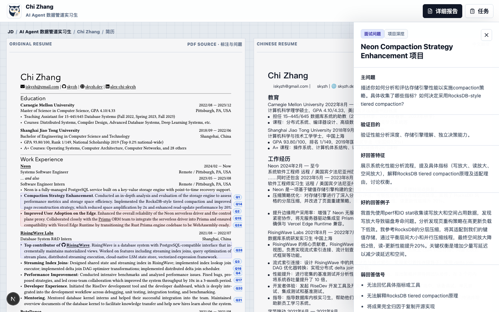

<p align="center">
  
</p>

<h1 align="center">Owl</h1>

<p align="center">
  <a href="README.md">English</a> | <a href="README.zh-CN.md">简体中文</a>
</p>

<p align="center">
  
  
  
  
  
  
</p>

Owl is a local interview analysis workspace. It turns job descriptions, candidate resumes, and supporting materials into verifiable interview preparation: resume review, evidence grounding, project deep dives, follow-up questions, and structured reports.

**Turn resume analysis into high-quality interviews.**



## Demo

The demo walks through the core flow: JD workspace, candidate list, resume evidence annotations, interview question drawer, and detailed report.


## Core Features

- Manage one JD workspace with its candidates and materials.
- Parse resumes and support bilingual review.
- Annotate key evidence directly on the original resume.
- Generate interview questions, follow-ups, and strong-answer references.
- Produce detailed reports with JD fit, risks, evidence, and question pools.
- Run locally, with candidate materials and analysis outputs stored on your machine.

## Workflow

```text
Create or open a JD workspace
  ↓
Upload or paste the JD
  ↓
Add candidate materials
  ↓
Parse and confirm resume text
  ↓
Run analysis
  ↓
Review resume annotations and interview questions
  ↓
Open the detailed report
```

## Local Development

Install dependencies:

```bash
bun install
# npm install
# pnpm install
```

Create your local environment file:

```bash
cp .env.example .env.local
```

Then set `JD_ANALYSIS_API_KEY` in `.env.local`. The default configuration uses DeepSeek. You can create an API key from [DeepSeek API Keys](https://platform.deepseek.com/api_keys), or switch to another OpenAI-compatible provider using the examples in `.env.example`.

Start the development server:

```bash
bun dev
# npm run dev
# pnpm dev
```

Open:

```text
http://localhost:3000
```

## Tech Stack

- Next.js App Router
- React
- TypeScript
- LangGraph / LangChain Core
- pdfjs-dist
- mammoth
- zod

The analysis flow is split into resumable nodes, including JD analysis, resume language detection, resume layout extraction, bilingual review, evidence annotation, question tree generation, and report data generation.

## Project Structure

```text
app/                         Next.js App Router pages and APIs
components/                  Product UI components
lib/analysis/                LangGraph analysis flow, nodes, and schemas
lib/extraction/              PDF / DOCX / text extraction
lib/persistence/             Local data persistence
lib/tasks/                   Background analysis task state
lib/report/                  Report data assembly
docs/                        PRD and technical documents
public/                      Logo, screenshots, and demo video
```

## Docs

- [Owl PRD](docs/Owl_PRD.md)
- [Owl technical documentation](docs/Owl_技术文档.md)
